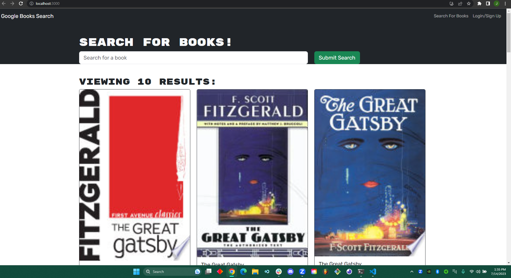

# MERN-HELP

## About
 - Created Mutations on the front end and backend for login User
 - Created mutatons for adduser
 - ... for saveBook
 - ... forremoveBook
 - created resolvers(queries) on front end and back end for ME 
 - used Apollo server instead of backend routes
 - used 2 seperate apollo link resolvers so that rest query to google would work
 